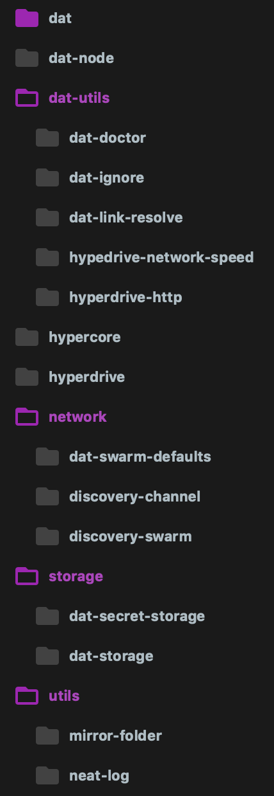

# (WIP) Dat Meta Repository

A [meta](https://github.com/mateodelnorte/meta) repository for the Dat Project aiming at making it easier for contributors to get started with Dat.

meta is:

> a tool for turning many repos into a meta repo. why choose many repos or a monolithic repo, when you can have both with a meta repo?



## Getting Started

These instructions will get you a copy of most of the major Dat Project dependencies and allow you to develop with them together.

### Prerequisites

Get `meta` installed first:

```
npm i -g meta
```

`meta` makes it easy to run commands like `npm test` on many repositories.

### Installing

```
meta git clone git@github.com:joehand/dat-meta.git
cd ./dat-meta
npm install
meta npm install
meta npm link --all
npm link
```
